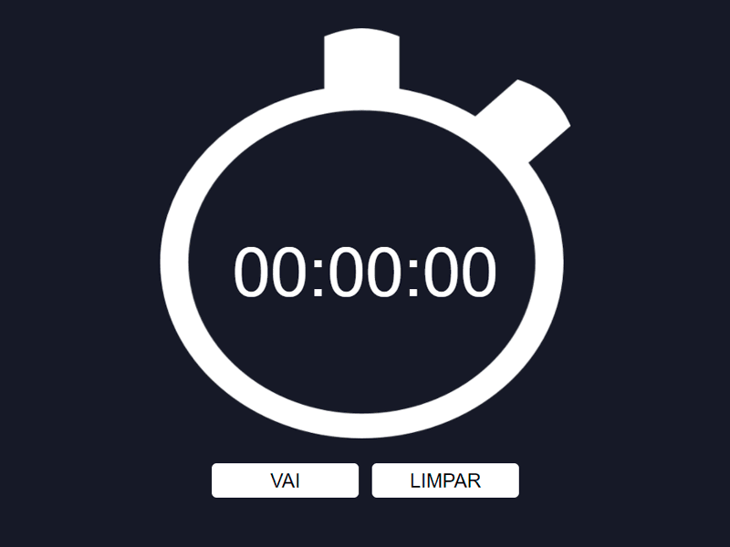

<div align="center">

</div>

### Cronômetro
Projeto para práticar [vueJS](https://cli.vuejs.org/), um cronômetro simples com javascript, css e html. <br />
[Link para aplicação](http://cronometro.caiogomesdev.link/)
### Get started
```
# Instale todas as dependências:
$ npm install

# Para desenvolvimento:
$ npm run serve

# Para produção:
$ npm run build
```

---

### Configuração personalizada
Siga a [Documentação oficial](https://cli.vuejs.org/config/).
